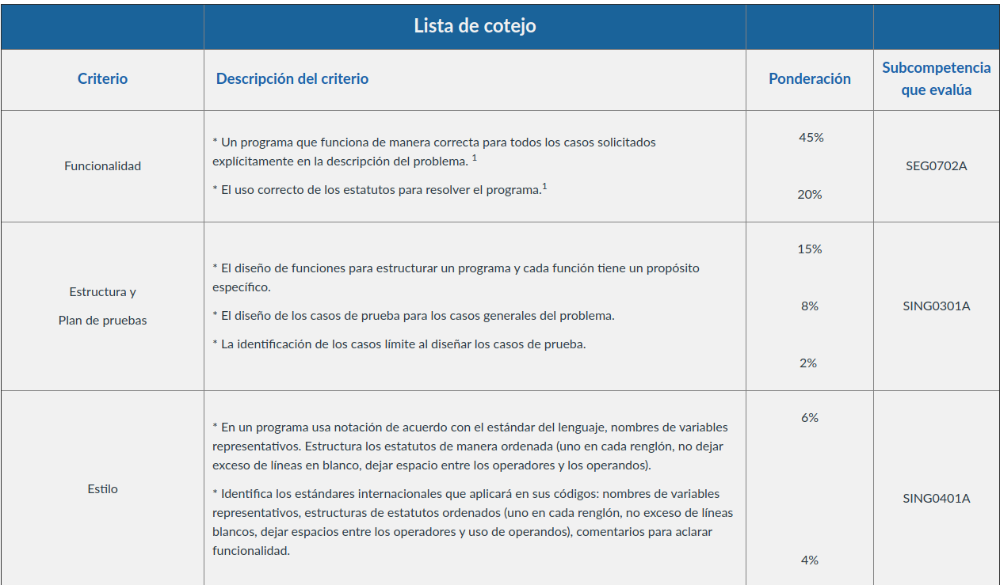

# TC1028

# Proyecto Integrador: Análisis de Datos

En este repositorio podrás guardar los archivos que conforman tu proyecto integrador en Python.

Recuerda que también deberas subir en Canvas (eLumen) un **archivo zip**  con todos los archivos que involucren tu proyecto.

Tu proyecto debe de cumplir con los estándares mínimos en el documento *Convenciones de estilo en Python* que se encuentra en el repositorio , así como el uso de **docstrings** en tus métodos .

Además del código fuente deberás entregar un ***reporte del proyecto integrador*** , este deberá contener:

- Explicación del proyecto integrador y su importancia en nuestra vida.
- Algoritmo (imagen de code2flow) de tu **método main** que nos indica la estructura de tu programa.
- Capturas de pantalla que muestren la ejecución del programa.

A continuación es la lista de cotejo que se utilizará para obtener la calificación del proyecto y como se evaluarán las subcompetencias que se han usado durante el curso.

